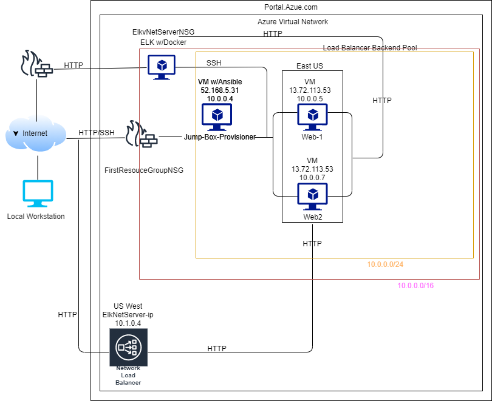

# UCDavisCyberSec
School Assignment Repo
## Automated ELK Stack Deployment

The files in this repository were used to configure the network depicted below.

These files have been tested and used to generate a live ELK deployment on Azure. They can be used to either recreate the entire deployment pictured above. Alternatively, select portions of the ansible playbook file may be used to install only certain pieces of it, such as Filebeat:

 - ansible
     - ansible.cfg
     - elksinstall.yml
     - filebeat-playbook.yml
     - hosts
     - metric-beat.yml
     - pentest.yml
 - files
     - filebeat-config.yml
     - metricbeat-config.yml

This document contains the following details:
- Description of the Topologu
- Access Policies
- ELK Configuration
  - Beats in Use
  - Machines Being Monitored
- How to Use the Ansible Build

### Description of the Topology

The main purpose of this network is to expose a load-balanced and monitored instance of DVWA, the D*mn Vulnerable Web Application.

Load balancing ensures that the application will be highly available, in addition to restricting access to the network.
- The load balancer is closed to the flow of inbound traffice unleess a pathway is explicitly opened by an network security group. The load balancer also dissalows known malicious IP addresses.

Integrating an ELK server allows users to easily monitor the vulnerable VMs for changes to the file system and system metrics.
- Filebeat monitors logs, manages log locations, and can forwarding logs to applications like eleasticsearh and logstash for examination. 
- Metricbeat collects and logs metrics and statistics for analysis

The configuration details of each machine may be found below.

| Name                 | Function        | IP Address | Operating System |
|----------------------|-----------------|------------|------------------|
| Jump-Box-Provisioner | Gateway         | 10.0.0.4   | Linux            |
| ELKvNetServer        | Load Balancer   | 10.1.0.4   | Linux            |
| Web-1                | Virtual Machine | 10.0.0.5   | Linux            |
| Web2                 | Virtual Machine | 10.0.0.7   | Linux            |

### Access Policies

The machines on the internal network are not exposed to the public Internet. 

Only the Jump-Box-Provisioner machine can accept connections from the Internet. Access to this machine is only allowed from the following IP addresses:
52.168.5.31

Machines within the network can only be accessed by private connection.

A summary of the access policies in place can be found in the table below.

| Name                 | Publicly Accessible  | Allowed IP Address  |
|----------------------|----------------------|---------------------|
| Jump-Box-Provisioner | No                   | 10.0.0.4            |
|                      |                      |                     |

### Elk Configuration
.
Ansible was used to automate configuration of the ELK machine. No configuration was performed manually. Ansible automation allows you to create and repidly deploy your Virtual Machine with YAML playbook files. This is also a repeatable process that allows you to modify and re-configure as necessary. 

The elkinstall playbook implements the following tasks:

- logs in as remote user
- apt installs docker
- apt installs pip3
- pip installs Docker python
- increases the VM memory to 262144
- set the public ports
- sets and enables the docker service on boot

The following screenshot displays the result of running `docker ps` after successfully configuring the ELK instance.

### Target Machines & Beats
This ELK server is configured to monitor the following machines:
Web1 10.0.0.5
Web-2 10.0.0.7

We have installed the following Beats on these machines:

filebeat-playbook.yml and metricbeat-playbook.yml

Kibana - has dashboards, visualizations, and searches to present data

Elasticsearch - json data base for storing log data;

Haproxy = collects and parses logs from a high availability proxy/load balancer ;

Kafka consomes, stores, and parses filebeat messages to logs;

Nats - sets path to logs, combines multiline log events into one event, helps to format and shape data

Osquery - collects and decudes results logs;

Google Santa - macOS security tool that can blacklist/whitelist binaries;

These Beats allow us to collect the following information from each machine:
Filebeat and Metricbeat ymls give us the ability to create, manage, ship, and data mine system log files.  These logs can be used to investigate rishk and to produce comprehensive security reports based captured log events.  

### Using the Playbook
In order to use the playbook, you will need to have an Ansible control node already configured. Assuming you have such a control node provisioned: 

SSH into the control node and follow the steps below:

- Copy the elkinstall.yml file to /etc/ansible .
- Update the /etc/ansible/hosts file to include you webservers addresses in the [webservers] section and the elk server address in the [elk].  Your added entries should look something like the following;

[webservers]
10.0.0.5 ansible_python_interpreter=/usr/bin/python3
10.0.0.7 ansible_python_interpreter=/usr/bin/python3

[elk]
10.1.0.4 ansible_python_interpreter=/usr/bin/python3

- Run the playbook, and navigate to ____ to check that the installation worked as expected.

_TODO: Answer the following questions to fill in the blanks:_
- _Which file is the playbook? Where do you copy it?_
- _Which file do you update to make Ansible run the playbook on a specific machine? How do I specify which machine to install the ELK server on versus which to install Filebeat on?_
- _Which URL do you navigate to in order to check that the ELK server is running?

_As a **Bonus**, provide the specific commands the user will need to run to download the playbook, update the files, etc._

azureuser@Jump-Box-Provisioner:~$ sudo docker ps -a
azureuser@Jump-Box-Provisioner:~$ sudo apt update
azureuser@Jump-Box-Provisioner:~$ sudo apt install docker.io
azureuser@Jump-Box-Provisioner:~$ sudo systemctl status docker
azureuser@Jump-Box-Provisioner:~$ sudo docker pull cyberxsecurity/ansible
azureuser@Jump-Box-Provisioner:~$ sudo docker run -ti cyberxsecurity/ansible:latest bash
docker container start charming_greider
docker container attach charming_greider

