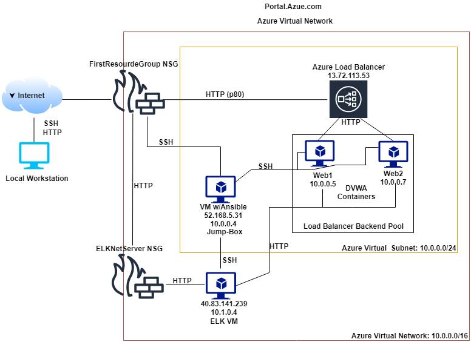
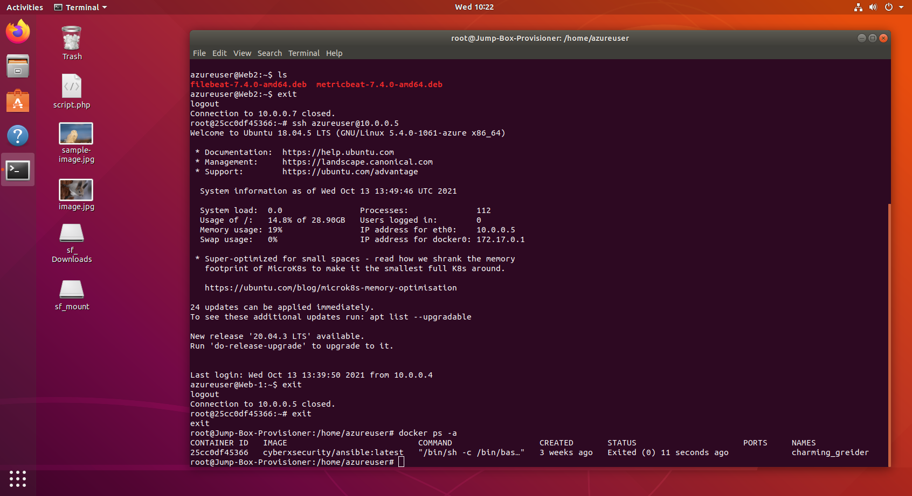

# UCDavisCyberSec
School Assignment Repo
## Automated ELK Stack Deployment

The files in this repository were used to configure the network depicted below.

These files have been tested and used to generate a live ELK deployment on Azure. They can be used to either recreate the entire deployment pictured above. Alternatively, select portions of the ansible playbook file may be used to install only certain pieces of it, such as Filebeat:

 - ansible
     - ansible.cfg
     - elksinstall.yml
     - filebeat-playbook.yml
     - hosts
     - metric-beat.yml
     - pentest.yml
 - files
     - filebeat-config.yml
     - metricbeat-config.yml

This document contains the following details:
- Description of the Topology
- Access Policies
- ELK Configuration
  - Beats in Use
  - Machines Being Monitored
- How to Use the Ansible Build

### Description of the Topology

The main purpose of this network is to expose a load-balanced and monitored instance of DVWA, the D*mn Vulnerable Web Application.

Load balancing ensures that the application will be highly available, in addition to restricting access to the public network.
- The load balancer is closed to the flow of inbound traffic unless a pathway is explicitly opened by an network security group. The load balancer also disalows known malicious IP addresses.

Integrating an ELK server allows users to easily monitor the vulnerable VMs for changes to the file system and system metrics.
- Filebeat monitors logs, manages log locations, and can forward logs to applications like elasticsearh and logstash for examination. 
- Metricbeat collects and logs metrics and statistics for analysis

The configuration details of each machine may be found below.

| Name                 | Function        | IP Address | Operating System |
|----------------------|-----------------|------------|------------------|
| Jump-Box-Provisioner | Gateway         | 10.0.0.4   | Linux            |
| ELKvNetServer        | Load Balancer   | 10.1.0.4   | Linux            |
| Web-1                | Virtual Machine | 10.0.0.5   | Linux            |
| Web2                 | Virtual Machine | 10.0.0.7   | Linux            |

### Access Policies

The machines on the internal network are not exposed to the public Internet. 

Only the Jump-Box-Provisioner machine can accept connections from the Internet. Access to this machine is only allowed from the following IP addresses:
52.168.5.31

Machines within the network can only be accessed by private connection.

A summary of the access policies in place can be found in the table below.

| Name                 | Publicly Accessible | allowed IP Address |
|----------------------|---------------------|--------------------|
| Jump-Box-Provisioner |          No         |       X.X.X.X      |
| ELKvNetServer        |         yes         |    40.83.141.239   |
| Web1                 |         yes         |    13.72.113.53    |
| Web2                 |         yes         |    13.72.113.53    |

### Elk Configuration
.
The Elk server was configured with a ansible YML file. Ansible playbooks allow us to create and rapidly deploy Virtual Machine. This process is repeatable and the playbook files can be modified and re-configure with ease. 

The elkinstall.yml playbook implements the following tasks:

- logs in as remote user
- apt installs docker
- apt installs pip3
- pip installs Docker python
- increases the VM memory to 262144
- set the public ports
- sets and enables the docker service on boot

The following screenshot displays the result of running `docker ps` after successfully configuring the ELK instance.

### Target Machines & Beats
This ELK server is configured to monitor the following machines:
Web1 10.0.0.5
Web-2 10.0.0.7

We have installed the following Beats on these machines:

filebeat-playbook.yml and metricbeat-playbook.yml

Kibana - has dashboards, visualizations, and searches to present data

Elasticsearch - json data base for storing log data;

Haproxy = collects and parses logs from high availability proxy/load balancer ;

Kafka consumes, stores, and parses filebeat messages. creates logs;

Nats - sets path to logs, combines multiline log events into one event, helps to format and shape data

Osquery - collects and decodes results logs;

Google Santa - macOS security tool that can blacklist/whitelist binaries;

Filebeat and Metricbeat modules give us the ability to create, manage, ship, and investigate system log files.  These logs can be used to investigate alerts and to produce comprehensive security reports based on captured log events.  

### Using the Playbook
In order to use the playbook, you will need to have an Ansible control node already configured. Assuming you have a control node provisioned: 

SSH into the control node (jump box) and follow the steps below:

- run; $ sudo docker ps   (checks for your ansible container)
- run; $ sudo docker container list -a    (locates your container name)
- run; $ sudo docker container start <container name>      (to start the container)
- run; $ sudo docker container attach <container name>     (to attach to the container)
- run; # cat ~/.ssh/id_rsa.pub    (copy and keep the SSH public key. You'll need user name and the ansible container ssh public key to configure your VM's.)
- edit the /etc/ansible/hosts file to include your webservers and your elk server ip addresses. like:
 
[webservers]
 
10.0.0.5 ansible_python_interpreter=/usr/bin/python3

[elk]
 
10.1.0.4 ansible_python_interpreter=/usr/bin/python3
 
 - run; /etc/ansible# ansible-playbook pentest.yml    (this will increase memory, install docker.io, install python3-php, and the docker Python pip modules) 
 - ssh into you ELK machine to verify you connection is working. If you have a working connection next step to run elk.
 - run; /etc/ansible# ansible-playbook elkinstall.yml   (to install the elk container - sebp/elk:761  w/ published port 5601:5601, 92002:9200, 5044:5044)
 - after running elkinstall.yml, ssh into you container and run; sudo docker ps  to check that the elk-docker is running

